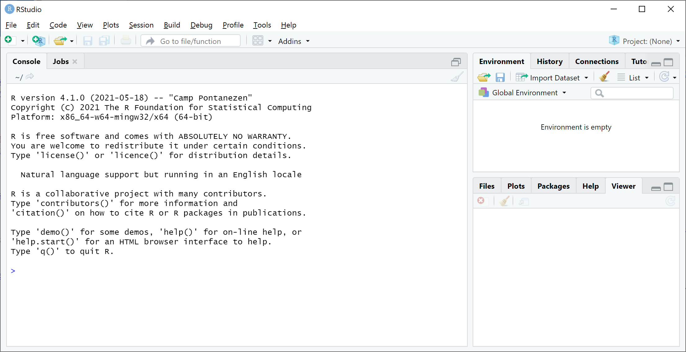
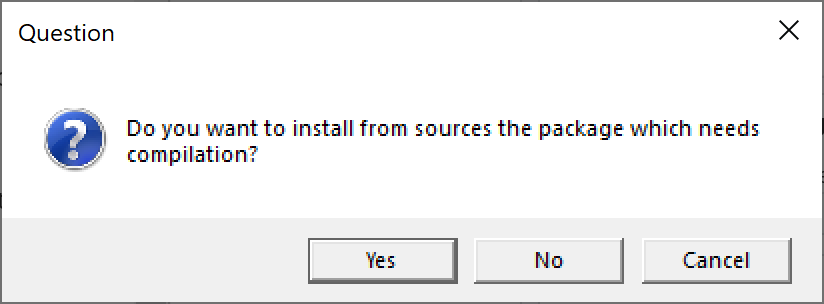
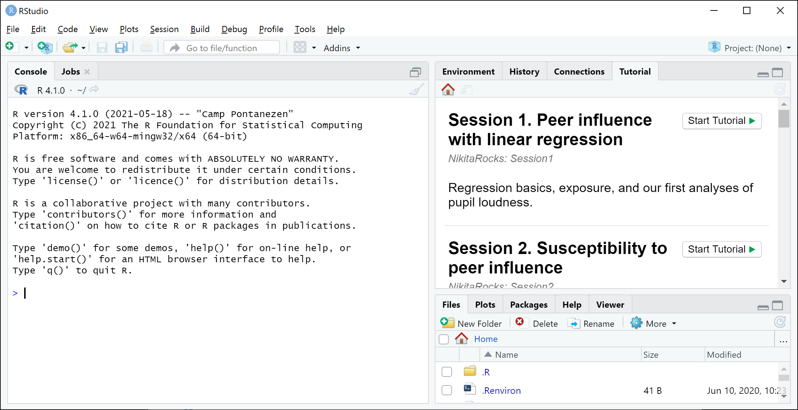

```{r setup, include=FALSE}
knitr::opts_chunk$set(echo = FALSE)
```

Dear summer course participant,

If you want to have hands-on experience during the sessions on modelling events in social networks, please install the following software (in the order specified here) on your computer before the start of these sessions.

### Step 1. Install the latest version of R

Go to https://www.r-project.org/, click the link __download R__, select a nearby download site (_mirror_), click the link to download R for your operating system (Linux, macOS, Windows), and download the application for your operating system version. After downloading the app, install it.

### Step 2. Install the latest version of RStudio

Go to http://www.rstudio.com/download, choose to download the free version, press the download button in the new window that opens, and install the downloaded app. Open the RStudio app after installation to check that it works. Note that RStudio automatically starts R (see the message at the top of the __Console__ panel in RStudio).



### Step 3. Install the R `remotes` package

We need this package to install the `NikitaRocks` package.

Type (or copy & paste) the following command after the prompt (`>`) in the RStudio __Console__ panel and execute it by pressing your Return/Enter key:

> install.packages("remotes")

### Step 4. Install the `NikitaRocks` package

This package contains the course materials and it installs all R packages that we need.

Type (or copy & paste) the following command after the prompt (`>`) in the RStudio __Console__ panel and execute it by pressing your Return/Enter key:

> remotes::install_github('WdeNooy/NikitaRocks')

This may take some time if many packages are being installed. Wait until you see the message `* DONE (NikitaRocks)`.

Answer with `3` (None) and press the Return/Enter key if R asks you if it should update packages.

Answer __no__ to the question: _Do you want to install from sources the package which needs compilation_. Press the __No__ button if you see a dialog like the one below, or type __no__ and press enter if the question is just written in the RStudio __Console__ tab.



After some time, the __Tutorial__ tab in RStudio (top-left) should show the six tutorials for our sessions. If not, close and reopen RStudio.



### Step 5. Install the `goldfish` package

We use the `goldfish` package to estimate models for predicting tie creation or dissolution in Session 6.

Type (or copy & paste) the following command after the prompt (`>`) in the RStudio __Console__ panel and execute it by pressing your Return/Enter key:

> remotes::install_github('snlab-ch/goldfish')

If you get the question whether you want to update packages, type __1__ and press Return/Enter.

Again, do __not__ install packages that need compilation.

Installation will take some time. If it succeeds, it shows the __* DONE (goldfish)__ text (and perhaps some warnings).

On a Mac computer, installation may fail and end with a message that _no suitable compiler(s) were found_ and that you have to install XCode.

If it fails and you feel comfortable with a non-standard installation procedure, follow these steps:

* Open the Terminal app (via Launchpad).
* Install Homebrew with the command in Terminal (wait for the command prompt `$` to reappear): `/bin/bash -c "$(curl -fsSL` https://raw.githubusercontent.com/Homebrew/install/HEAD/install.sh)"
* Install 'gcc' with the command in Terminal (wait for the command prompt `$` to reappear): `brew install gcc`
* Copy the location where gcc was installed, something starting with `/usr/local/`, for example, `/usr/local/Cellar/gcc/11.1.0_1`
* Note that in this example, `11` is the version number we need in the next step.
* In Finder, go to `/Library/Frameworks/R.framework/Resources/etc/`, open the file `Makeconf` and replace the lines (using the gcc version number, here `11`):
    + `CC = clang` by `CC = gcc-11`
    + `CXX = clang++` by `CXX = g++11`
    + `FLIBS =  -L/usr/local/gfortran/lib/gcc/` by `FLIBS = -L/usr/local/Cellar/gcc/11.1.0_1 -L/usr/local/lib/gcc/11 -lgfortran -lquadmath -lm`
* Close and re-open RStudio and install the goldfish package again (see above).

### That's it!
